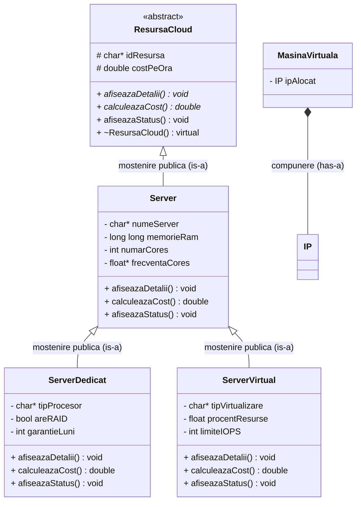

# ProiectOOP

## Cum se compileaza si ruleaza

Proiectul foloseste **CMake** pentru build.

Pentru a compila si a rula aplicatia (meniul interactiv), deschideti terminalul in radacina proiectului si introduceti:

```bash
# Configurarea proiectului
cmake -S . -B cmake-build-debug -DCMAKE_BUILD_TYPE=Debug

# Compilarea proiectului
cmake --build cmake-build-debug -j

# Rularea meniului interactiv
./cmake-build-debug/ProiectOOP
```

## Arhitectura & Polimorfism (Proiect 2)

Ierarhia claselor a fost gandita pentru a respecta cerintele de mostenire publica, clase abstracte si polimorfism.

Mai jos este diagrama UML a ierarhiei de clase (folosind *Mermaid*), in care se observa aplicarea conceptelor OOP:



### Explicatii pe scurt

- **`ResursaCloud` (Level 1)**: Clasa abstracta fundamentala, avand 2 metode pur virtuale (`afiseazaDetalii` si `calculeazaCost`) alaturi de un destructor virtual esential pentru eliberarea corecta a memoriei. Aceasta nu poate fi instantiata.
- **`Server` (Level 2)**: Mosteneste resursele din nivelul 1, oferind definitii pentru metodele virtuale, implementand totodata *Rule of Three*.
- **`ServerDedicat` & `ServerVirtual` (Level 3)**: Extind clasa `Server`. Suprascriu (*override*) din nou metodele virtuale aducand calcule si functionalitati unice de tipar. De exemplu, in meniu ele vor beneficia de verificari *runtime* utilizand operatiunea sigure `dynamic_cast`.
- **`MasinaVirtuala` & `IP`**: Demonstreaza conceptul de *compunere* (has-a), `IP` fiind instantiat direct din *initializer list*.

## Testare automata

Proiectul include scripturi pentru teste automate in `run_all_tests.fish` care ruleaza end-to-end scenarii pentru toate functionalitatile implementate. Poate fi rulat folosind:
```bash
fish run_all_tests.fish
```

## Caracteristici Proiect 3 & Design Patterns

Proiectul a fost extins cu concepte avansate de C++17 si design patterns:

### 1. Ierarhie de exceptii custom
- Clasa de baza `ExceptieCloud` (derivata din `std::runtime_error`).
- Subclase specifice: `ExceptieValidare`, `ExceptieResursaIndisponibila`, `ExceptieCapacitateDepasita`.
- Exceptiile sunt aruncate la validari (ex: IP invalid, cores < 1) si prinse in meniu fara crash-uri.
- Demonstratie de **stack unwinding** la startup.

### 2. Clase si functii template
- Clasa template `Depozitar<T, N>` cu parametru non-tip `N` (capacitate la compilare) pentru stocarea resurselor.
- Functii template libere: `cautaLiniar` (cu specializare completa pentru `ResursaCloud`), `sorteaza` (Bubble Sort generic) si `numara`.

### 3. Containere STL si Algoritmi
- Inlocuit vectorii statici/dinamici cu containere STL (`std::vector<Server*>`, `std::vector<IP>`, `std::vector<MasinaVirtuala>`, `std::vector<Datacenter>`).
- Utilizare algoritmi STL cu expresii lambda: `std::sort` (sortare dupa cost), `std::find_if` (cautare prag cost), `std::count_if` (numarare online), `std::for_each` (afisare sumara), `std::any_of` (verificare VM pornit), `std::transform` (extragere nume).
- Aplicat **erase-remove_if idiom** pentru eliminarea elementelor din colectii.

### 4. Migrare la std::string
- Toate campurile `char*`/`char[]` au fost migrate la `std::string`.
- Acest lucru elimina managementul manual de memorie (*Rule of Three*) pentru clasele fara pointeri raw proprii (`IP`, `ResursaCloud`, `ServerDedicat`, `ServerVirtual`, `Datacenter`).
- *Rule of Three* ramane doar pe clasele cu resurse dinamice raw (`Server` si `MasinaVirtuala` care au `float*`).

### 5. Interfata IObject
- Ofera auto-incrementare globala cu ID unic pentru fiecare obiect creat.
- Functia pur virtuala `toString()` implementata polimorfic de fiecare clasa concreta.
- Supraincarcare `operator<<` polimorfic care apeleaza `toString()` intern.
- `operator==` comparat dupa ID.

### 6. Design Patterns
- **Singleton (Meyers)**: Clasa `Logger` utilizata pentru inregistrarea automata a tuturor actiunilor din sistem (creari, stergeri, evenimente CRUD).
- **Abstract Factory**: Interfata `FabricaProviderAbstract` si familiile concrete (`FabricaProviderA` - AWS, `FabricaProviderB` - Azure) care produc variante compatibile de `ServerDedicat` si `ServerVirtual`. Dependency injection realizat prin clasa `ClientCloud`.

